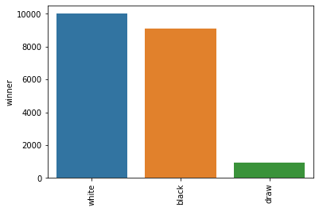
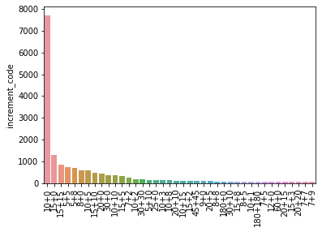
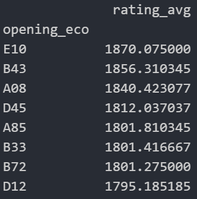
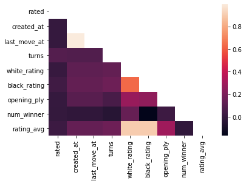

# Chess Game Outcome Predictor: Project Overview
* Created a tool that predicts the winner (accuracy of .88) of a chess game
* Explored and analyzed a 20,000+ row dataset
* Found optimal hyperparameters for KNN, decision tree, naive bayes, random forest, logistic regression, and gradient boost classifiers using GridSearchCV

# Packages and versions used
* Python 3.9.6
* Pandas 1.3.1
* Numpy 1.19.5
* Scikit-learn 0.24.2
* Matplotlib 3.4.3
* Seaborn 0.11.1

# The Data
Dataset from https://www.kaggle.com/datasnaek/chess

The features included in the dataset were the following:
* Game ID: Lichess gives every game played a unique ID
* Rated: Whether or not the game was rated
* Start time: The time the game started
* End time: The time the game ended
* Number of turns: The total number of turns played per player
* Victory status: How the game was won (checkmate, resignation, runnning out of time)
* Winner: Who won the game
* Increment: The time format played
* White's ID: The player with the white pieces' lichess username
* White's rating: The ELO rating of the player with the white pieces
* Black's ID: The player with the black pieces' lichess username
* Black's rating: The ELO rating of the player with the black pieces
* Moves: The algebraic notation of the moves played in the game
* Opening ECO: ECO (classification system for any opening moves) of the opening played
* Opening name: Actual name of the opening played 
* Opening ply: The number of moves in the opening

# Exploration Highlights
|  |
|:--:| 
| *Barplot showing the number of games that ended with white winning, black winning, or a draw* |
This barplot clearly shows that white wins more frequently than black and draws are much less common than the game ending in a checkmate, resignation, or a player running out of time. White always plays first in chess and therefore has an advantage right off the bat resulting in the player with that color winning more frequently.

|  |
|:--:| 
| *Barplot showing the number of games played with the 40 most popular time increments* |
By far the most popular time increment played was 10+0 likely because this is a solid middle ground; it allows the time to be a factor in the game but not so much so that the players do not have time to think before moving.

|  |
|:--:| 
| *Table displaying the openings with more than 20 games in which they were played that have the highest average rating* |
The opening ECO with the highest average rated players (1870) was E10 which is the [Queen's Pawn Game](https://lichess.org/editor/rnbqkb1r/pppp1ppp/4pn2/8/2PP4/5N2/PP2PPPP/RNBQKB1R_b_KQkq_-_0_1) defined as having the following opening moves: 1 d4 Nf6 2 c4 e6 3 Nf3. After this was B43 or the [Kan variation of the Scilian Defense](https://lichess.org/editor/rnbqkbnr/1p1p1ppp/p3p3/8/3NP3/2N5/PPP2PPP/R1BQKB1R_w_KQkq_-_0_1) (1. e4 c5 2. Nf3 e6 3. d4 cxd4 4. Nxd4 a6 5. Nc3) with an average rating of 1856.

|  |
|:--:| 
| *Heatmap showing the correlations between the categories with numerical values in the dataset* |
This heatmap shows many obvious strong correlations such as that between when the game started and ended, the average rating and white's rating, average rating and black's rating. Interestinly, the rating of black has near no correlation with who won the game whereas white's rating has a weak correlation but not nearly as much as black's. Black rating and white rating are not quite as correlated as I would have guessed before seeing this plot. There is also a medium correlation between the average rating of the players in the games and the opening ply (the number of moves in the opening); this is likely because players with higher rating (and therefore better players) will have those longer openings memorized and can play them whereas players with lower rating most likely do not have many/any openings with more than a couple moves memorized.

| Misc. insights |
| ----------------- |
| Van't Krujis opening is the most commonly played; this is likely due to the fact that it is a single move, e3 |
| White's rating is higher on average (by about 8) than black's |
| The lowest rating in dataset is 784 and highest is 2723 |
| It will usually take black more turns to win than it will white: 57.8 avg vs 60.7 avg and draws go on for many more moves than wins |
| One player has 5 of their games in the dataset |
| Most games end due to a resignation |
| The most common rating for both black and white is 1500 because Lichess assigns this rating to all new players before they have completed their placement games |
| The game with the most turns played had 151 turns and was in the 20+11 time increment |

# Modeling

# Performance
The gradient boost with n_classifers set to 1000 performed the best with 88% accuracy, however, it has a long fit time.
* KNN: .48
* Decision Tree: .65
* Naive Bayes: .5
* Random Forest: .68
* Logistic Regression: .5
* Gradient Boost: .88

# Productionization

